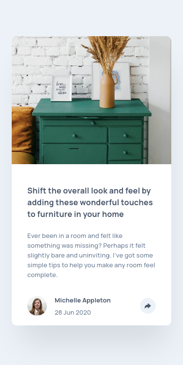
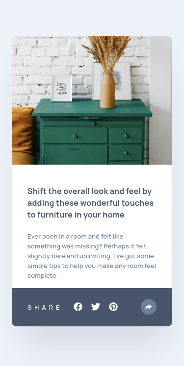
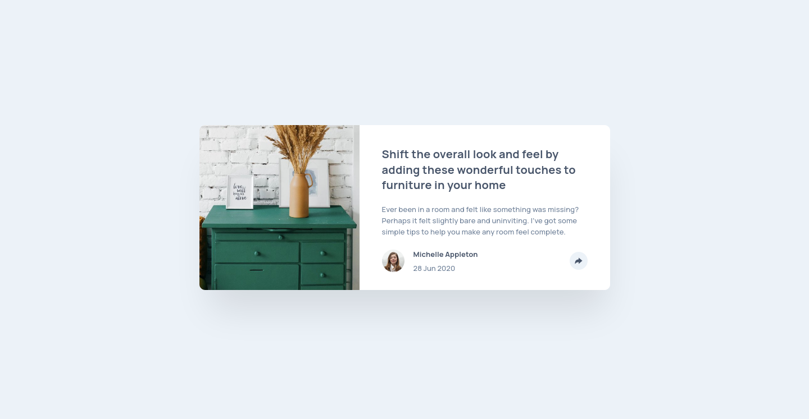
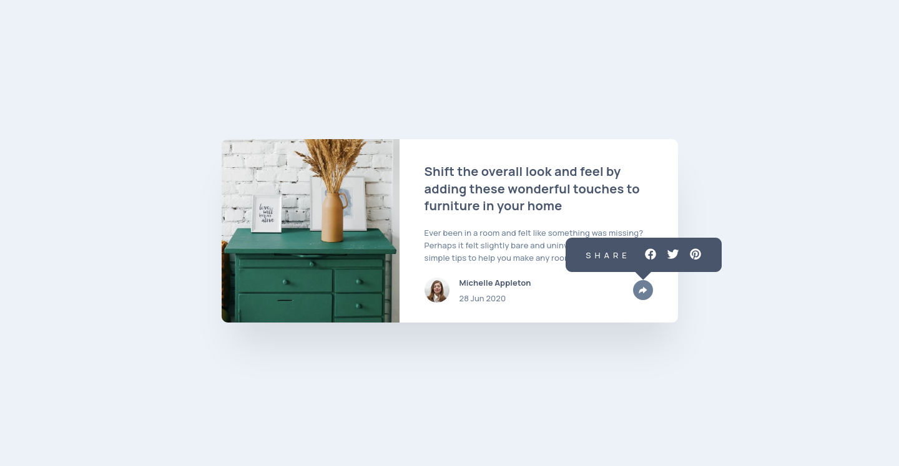

# Frontend Mentor - Article preview component solution

This is a solution to the [Article preview component challenge on Frontend Mentor](https://www.frontendmentor.io/challenges/article-preview-component-dYBN_pYFT). Frontend Mentor challenges help you improve your coding skills by building realistic projects.

## Table of contents

- [Overview](#overview)
  - [The challenge](#the-challenge)
  - [Screenshot](#screenshot)
  - [Links](#links)
- [My process](#my-process)
  - [Built with](#built-with)
  - [What I learned](#what-i-learned)
- [Author](#author)

## Overview

### The challenge

Users should be able to:

- View the optimal layout for the component depending on their device's screen size
- See the social media share links when they click the share icon

### Screenshot

#### Mobile





#### Desktop





### Links

- Solution URL: [Solution](https://www.frontendmentor.io/solutions/article-preview-component-with-sass-flexbox-and-bem-o324zMUAX)
- Live Site URL: [Live Site](https://ascecent.github.io/fem-article-preview-component/)

## My process

### Built with

- SASS
- HTML5 markup
- Flexbox
- Mobile-first workflow

### What I learned

You can use css to make a text vertically written with this properties:

```css
.vertical-text {
  writing-mode: vertical-lr;
  text-orientation: upright;
}
```

## Author

- Frontend Mentor - [@Ascecent](https://www.frontendmentor.io/profile/Ascecent)
